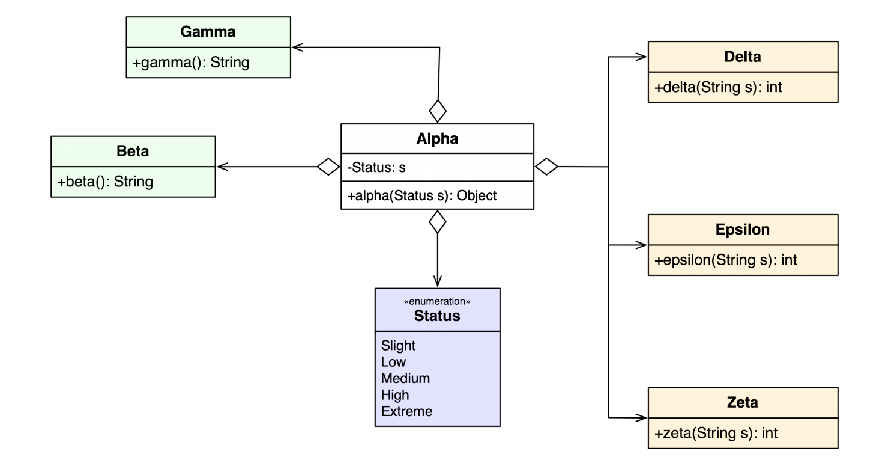
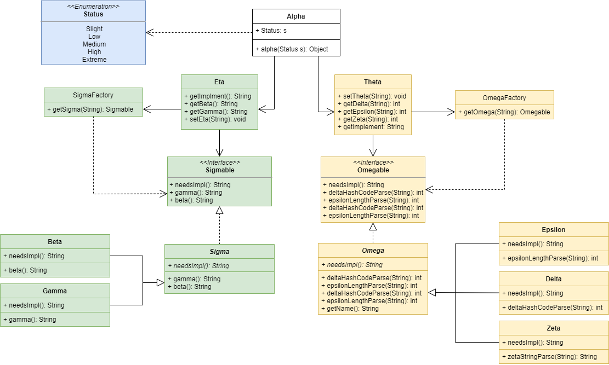

# Advanced Object Oriented Programming Design Principles and Patterns

## File Structure 

- **docs** : contains Javadocs generated for all classes.
- **src** : contains the package which holds all .java classes and contains the module-info.java.
- **New_Design.png** : a new png of my refactored design.
- **Old_Design.PNG** : a png of the old design before redesign and refactorying.
- **README.md** : README for git repository.
- **README.pdf** : a pdf documenting my design choices and rationale.
- **aoodppAssessment-1-2020.pdf** : a pdf documenting the original assessment instructions.

## Assessment Description

You are required to provide a redesign and refactoring of the classes above that provides
maximum reusability, extensibility and eliminates as many dependencies as possible in the
class Alpha. You are free to change any of the classes in any way you wish, including renaming,
changing method signatures and deriving new types. Any new classes or class names should be
taken from the set {Eta, Theta, Iota, Kappa, Lambda, Omicron, Sigma, Omega}. You must
implement your design as a set of Java classes and document your rationale in no more than
300 words in a README file and a UML class diagram. You should also document your
rationale for the design of each class in JavaDoc comments after the package statement. 

## Redesign and Refactor

### Explanation of Design Choice

Assuming Delta, Epsilon, and Zeta (Yellow) are in a group of their own, Gamma
and Beta (Green) are in another, and Status and Alpha don’t belong to a group.

  I extracted a new abstract class Omega from which Delta, Epsilon and Zeta
extend. I then extracted an interface Omegable from Omega which encapsulates Omega and all its extending classes, leaving the interface as the only point
of entry for all things extending Omega. Next, I used the factory creational
design pattern with a singleton to create a class OmegaFactory, which has a dependency on Omegable for its getOmega(String): Omegable method. This
is used to create new classes of type Omegable (e.g. Delta/Epsilon/Zeta). I
decoupled the usage of an object from its creation by creating the Theta class
as a dependency injection. Theta holds private references of OmegaFactory and
1
Omegable and through public methods allows for the creation and manipulation
of the object created.

  I repeated the steps above for Gamma and Beta by extracting an abstract
class Sigma and then extracting an interface Sigmable. I created the SigmaFactory which has a dependency on Simgable. Finally, I created Eta as a dependency injection which holds private references on SigmaFactory and Sigmable
which can be accessed through public methods.

  Using these design patterns allowed me to half the dependencies on Alpha
form six to three. This allows ease of extensibility and reusability through abstraction, interfaces, and factories. Alpha now contains two private references
to Theta and Eta. Therefore in its alpha method it decides what class to create
and manipulate, based on the Status parameter passed.

  I believe this helps promote high cohesion and loose coupling. The user will
only have to create an instance of Alpha and print out a line with the alpha
method passing Status as the parameter.
